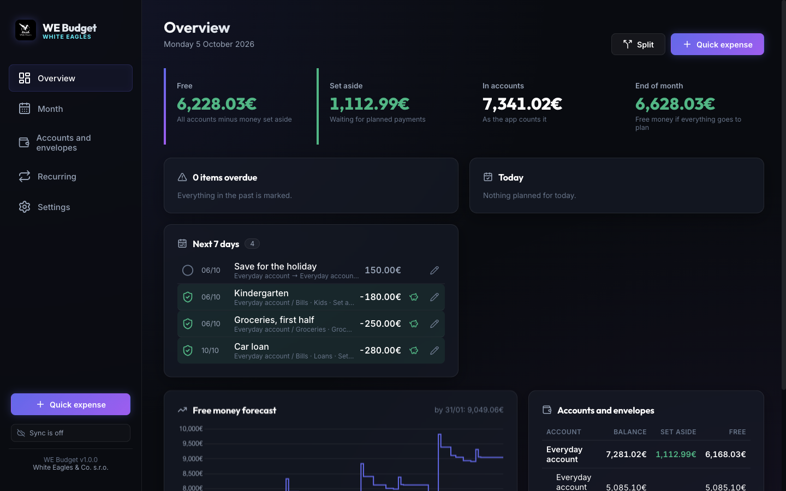
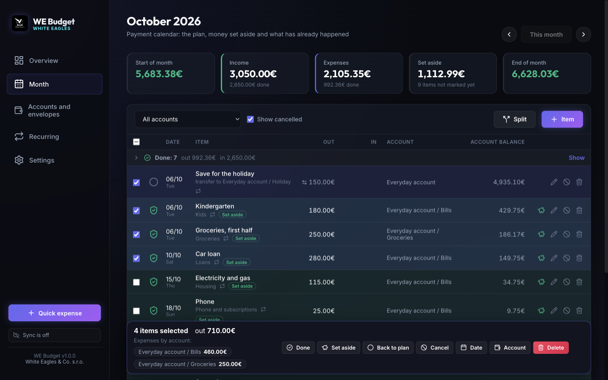
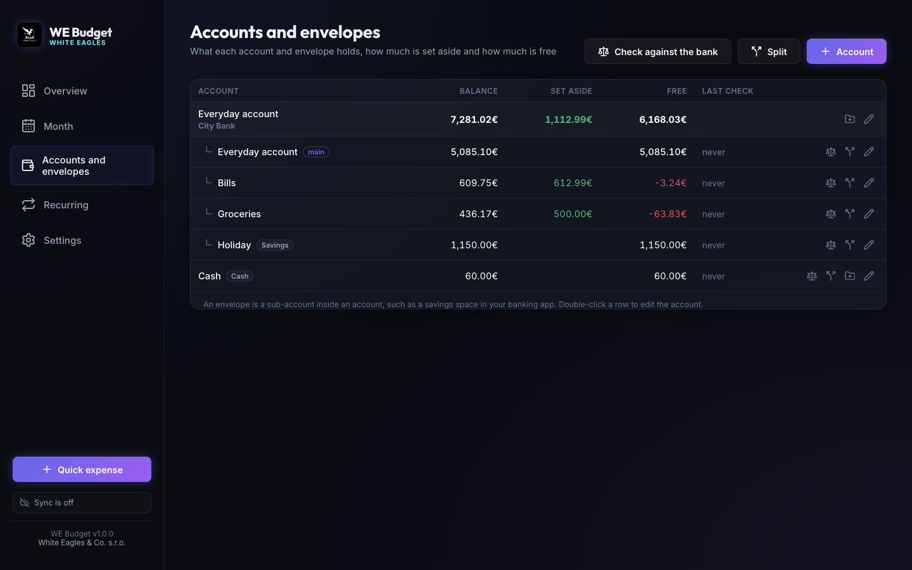
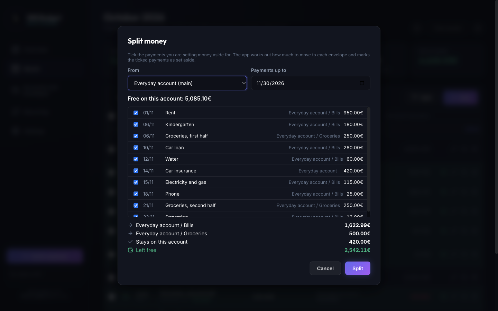
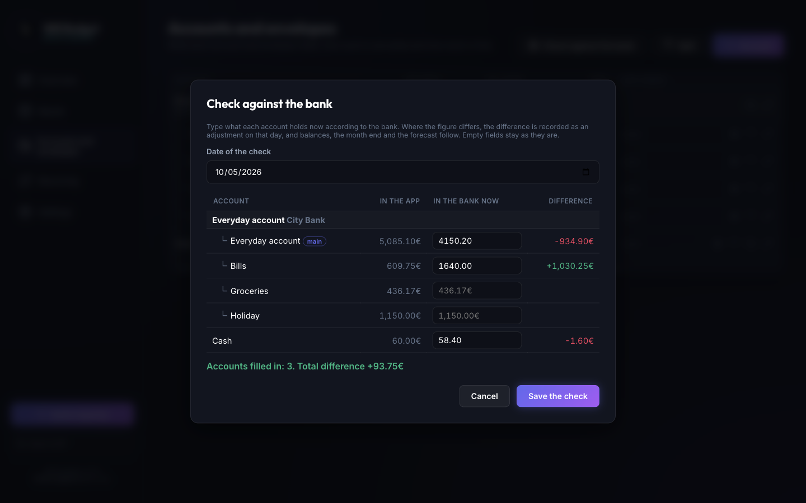
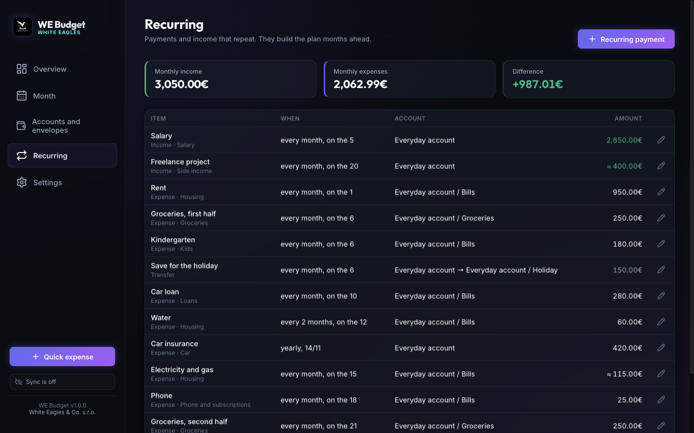

# WE Budget

WE Budget is a desktop budgeting app built around a payment calendar. You plan every payment and income of the month, set money aside in envelopes as soon as income lands, and tick payments off when they happen. At any moment it tells you how much money is really free and which upcoming payment there will not be enough money for.

It runs on macOS and Windows, works offline, keeps your data on your own computer and can sync it between computers through your own Google Drive. Made by [White Eagles & Co. s.r.o.](https://whiteeagles.sk/)

Website: [jaffarsk24.github.io/WE-Budget](https://jaffarsk24.github.io/WE-Budget/) · [Privacy policy](https://jaffarsk24.github.io/WE-Budget/privacy.html)



## What it does

- **Payment calendar.** Each month is a list of payments and incomes with a status: planned, set aside, done or cancelled. Payments still waiting for money are highlighted, done rows fold away under one line, and the balance column shows what is left on the row's own account after each payment.
- **Envelopes.** Accounts can hold envelopes (sub-accounts, like the spaces of a banking app). Money set aside on an envelope belongs to its payments and never counts as free money for anything else.
- **Splitting income.** When income arrives, the app proposes how much to move to each envelope to cover the payments until the next income, and marks those payments as set aside.
- **Checking against the bank.** Type what your bank shows and any difference becomes a visible adjustment, so balances and the forecast stay true without guesswork.
- **Recurring payments.** Monthly, every few months (optionally shown in the other months with a zero amount), yearly, weekly or once. The plan for the next months builds itself; approximate amounts are confirmed when a payment is marked done.
- **Overview.** Free money right now, the first payment there will not be enough money for, the next seven days and a forecast of free money.
- **Bulk actions.** Tick several rows to mark them done, set money aside, move dates or change accounts at once. The bar at the bottom adds the ticked payments up per account.
- **Small expenses** with optional monthly limits per category.
- **Analytics**: income and expenses month by month, expenses by category with averages over 3, 6 and 12 months, income by source, plan against fact, and how this month's limits stand.
- **Goals**: an amount, the envelope you save on and a date; the app shows how far you are and how much to set aside per month.
- **Menu bar**: free money next to an icon in the Mac menu bar (the notification area on Windows), with a quick expense in its menu.
- **Pass-through money**, such as money someone sends you to pay a bill on their behalf, is kept out of income and expense totals.
- **Sync** between computers and the phone through a hidden app folder on your Google Drive.
- **Phone app**: today's and overdue payments, marking them, quick expenses and what is free, added to the home screen of an iPhone or an Android phone.
- **Reminders** in Google Calendar at the time you choose, so they reach your phone even when every computer is off, and notifications on the computer while the app is open.
- **Updates** from GitHub Releases, offered right in the app.
- English and Russian, dark and light theme.

## Screenshots

| | |
|---|---|
|  |  |
| Month view: statuses, balance per account, ticked rows added up per account | Accounts and envelopes: balance, money set aside, free money |
|  |  |
| Splitting income across envelopes | Checking all accounts against the bank at once |



The screenshots use the built-in demo household; every name and amount in it is made up.

## Install

Download the latest version from the [Releases](https://github.com/JaffarSk24/WE-Budget/releases/latest) page.

### macOS

1. Download `WE-Budget-<version>-mac-arm64.dmg` for Apple silicon (M1 and later) or `WE-Budget-<version>-mac-x64.dmg` for Intel Macs.
2. Open it and drag WE Budget to Applications.
3. Before opening the app for the first time, run this once in Terminal:

   ```bash
   xattr -cr "/Applications/WE Budget.app"
   ```

   The app is signed ad hoc and not yet notarized by Apple. Files downloaded in a browser carry a flag that makes macOS refuse such apps, and the command removes that flag. After it WE Budget opens like any other app.

If you opened the app before running the command and macOS refused, run the command now, or open System Settings, Privacy & Security, and choose Open Anyway next to the message about WE Budget.

Later versions are installed by the app itself, with no extra steps.

### Windows

1. Download `WE-Budget-<version>-win-x64.exe` and run it.
2. The installer asks no questions and needs no administrator rights: WE Budget is installed for your Windows account, gets shortcuts on the desktop and in the Start menu, and starts.

The installer is not yet code-signed, so on the first install SmartScreen may show "Windows protected your PC". Choose More info, then Run anyway. Updates are downloaded and installed by the app itself and do not show this message. Windows 11 with Smart App Control turned on does not run unsigned apps at all, so WE Budget cannot be installed there yet.

Every change to the code is checked on a clean Windows machine: the installer and the installed app are scanned by Microsoft Defender with cloud protection on, then installed, started, updated and removed (see `scripts/check-windows-install.ps1`).

### On your phone

The phone app is the same app in a browser, made for a phone: today's and overdue payments, marking them, quick expenses and what is free on the accounts. The plan, recurring payments and accounts are edited on the computer.

1. Open [jaffarsk24.github.io/WE-Budget/app](https://jaffarsk24.github.io/WE-Budget/app/) in Safari on the iPhone, or in Chrome on Android.
2. Tap Share, then Add to Home Screen (Chrome: the menu, then Add to Home screen).
3. Open WE Budget from the home screen and sign in with the same Google account as on the computer. The budget comes down from your Google Drive.

A web app gets access to Google Drive for an hour at a time. When the hour is over, the sync button at the top says so, and one tap opens Google's window, which closes by itself, and sync goes on. The budget itself stays on the phone and works offline.

## Getting started

On first launch you can:

- **start from scratch**: add your accounts and what they hold right now;
- **sign in with Google** if you already keep your budget on another computer, and it comes down from the cloud;
- **open a file**: a WE Budget backup or the result of a spreadsheet import;
- **look at the demo** first and delete it later in Settings.

A typical routine:

1. Add envelopes to your accounts (Accounts and envelopes, the folder icon on an account), for example Bills or Groceries.
2. Add your recurring payments and incomes (Recurring). The months ahead fill themselves.
3. When income arrives, mark it done. The app offers to split it: confirm, and the money for the coming payments is set aside on their envelopes.
4. Mark payments done as they go out: the circle on the row, or Space on the selected row.
5. Record small spending with Quick expense (Cmd+N on macOS, Ctrl+N on Windows).
6. Every now and then, use Check against the bank on the Accounts screen and type in what your banks show.

## How the numbers work

| Status | Meaning |
|---|---|
| Planned | The payment is in the plan, no money is set aside for it yet. Expenses in this state are highlighted. |
| Set aside | The money is already on the right envelope. It stays in the plan and is no longer counted as free. |
| Done | The money has actually gone out or come in. Marking a later-dated payment done moves it to today. |
| Cancelled | Skipped this time; it does not count anywhere. |

- **Free money** is everything on your accounts minus everything set aside.
- **The first payment without enough money** follows free money forward in time: incomes come in, payments with nothing set aside go out. Money set aside for one payment never covers another.
- **The balance column** in the month view shows the money on the row's own account after that row. The total row shows the month result over all accounts.
- **Tracking start** is the day account balances are counted from. Anything earlier is history: it shows in the month views but does not change balances.
- **Adjustments** come from checking against the bank. They are listed with the done rows and summed up on the month card.

## Keyboard

| Key | Action |
|---|---|
| Cmd/Ctrl+N | Quick expense |
| Shift+Cmd/Ctrl+N | New item |
| Cmd/Ctrl+1 to 7 | Switch section |
| Up, Down | Move between rows of the month |
| Space | Mark the row done, or undo |
| R | Set money aside for the row, or undo |
| X | Tick the row |
| Cmd/Ctrl+A, Esc | Tick all rows, clear the ticks |
| Enter | Edit the row |
| Delete | Delete the row |
| Left, Right | Previous or next month |

Shift-click on a checkbox ticks a range. Every destructive action can be undone from the message that appears at the bottom.

## Reminders

In Settings, Reminders, choose the time (23:00 by default) and switch on reminders through Google Calendar. The app creates a calendar of its own, "WE Budget", in your Google account and puts an event with a reminder on every day that still has payments not marked yet; it updates the events as you mark payments, from any computer or the phone. Google sends the reminder, so it reaches your phone even when every computer is off; add the Google account to the iPhone Calendar or install Google Calendar to get it there. The app cannot see your other calendars, and switching the reminders off deletes its calendar.

While the desktop app is open, it can also show a notification at that time, and a morning summary of the day's payments at 8:00.

## Sync between computers

Sign in with Google in Settings, or on the first-launch screen of a new computer. The budget is stored as one compressed file in the app's hidden folder on your Google Drive: neither other apps nor you see it in Drive, and nothing is kept on any other server.

The app syncs on start, a few seconds after a change, every five minutes and before it closes. Changes made on different computers are merged record by record; the newer change of a record wins and deletions are kept. If a computer and the cloud hold two different budgets, the app asks which one to keep and never mixes them. Without a connection everything keeps working and goes up later. If Google stops honouring the sign-in (for example after access was revoked), a banner at the top asks to sign in again on every start until you do; meanwhile changes are kept on the computer. What the app stores, where, and how to remove it is described in the [privacy policy](https://jaffarsk24.github.io/WE-Budget/privacy.html).

## Updates

On start the app checks this repository for a new release. If there is one, a banner offers to update: the app downloads the build for your system and processor, verifies its checksum, replaces itself and starts again. Before it closes it sends unsent changes to Google Drive. On Windows the installer then runs silently into the same folder.

## Your data

| System | Location |
|---|---|
| macOS | `~/Library/Application Support/WE Budget/we-budget-data.json` |
| Windows | `%APPDATA%\WE Budget\we-budget-data.json` |
| Phone app | the browser's storage of jaffarsk24.github.io |

The app keeps a copy of the file every day (the last 14) in the `backups` folder next to it, and a separate copy before the whole budget is ever replaced. Settings also has a manual backup and restore and an export of all items to CSV for Excel or Google Sheets.

## Importing a spreadsheet

If you kept your budget in a spreadsheet with one block per month (the payments, then a subtotal line with the money carried over), it can be imported:

```bash
node scripts/import-sheet.mjs --csv export.csv --rules my-rules.json --out budget.json
```

The rules file describes your spreadsheet: which column is which, which account each account label means, how titles should be cleaned up, categories, pass-through items and recurring payments that are not monthly. See [docs/import-rules.example.json](docs/import-rules.example.json). The script prints a month-by-month comparison with the spreadsheet's own totals; where the spreadsheet was corrected by hand, the gap becomes a visible adjustment. Open the resulting `budget.json` with Settings, Restore from a backup.

## Building from source

You need Node.js 20 or newer.

```bash
npm install
npm run electron:dev        # the desktop app with live reload
npm run dev                 # the same interface in a browser, data in localStorage
npm test                    # unit tests (Vitest)
npm run lint
npm run electron:dist       # macOS: dmg and zip for Intel and Apple silicon
npm run electron:dist:win   # Windows: NSIS installer
npm run build:web           # the phone app, into dist-web/ (published at /WE-Budget/app/)
```

Builds go to `release.nosync/`. Google sign-in needs an OAuth client of the Desktop type with the Drive API enabled: put it into `oauth-credentials.json` in the project root as `{ "clientId": "...", "clientSecret": "..." }`. The file is not committed and is bundled into the build. A `google-credentials.json` of the same shape in the app's data folder overrides it.

### Project layout

| Path | What is there |
|---|---|
| `src/model.js`, `src/store.js` | Data model and the store that changes and saves it |
| `src/ledger.js` | Balances, money set aside, month totals, forecast |
| `src/schedule.js`, `src/allocation.js`, `src/reconcile.js` | Recurring payments, splitting income, checking against the bank |
| `src/sync/` | Merging budgets and the sync cycle |
| `src/reminders.js`, `src/reminder-sync.js`, `src/notify.js` | Reminders in Google Calendar, notifications on the computer |
| `src/web/`, `src/views/phone.js` | Google sign-in and Drive in the browser, the phone screens |
| `src/views/analytics.js`, `src/views/goals.js`, `src/tray.js` | Analytics, goals, the menu bar |
| `src/views/` | Screens |
| `main/` | Electron main process: Google sign-in and Drive transport, updater |
| `src/import/` | Spreadsheet import |
| `tests/` | Unit tests |
| `site/` | The website on GitHub Pages: the app page and the privacy policy |
| `scripts/check-windows-install.ps1` | Install check on a clean Windows machine, run by CI |

Built with Electron, plain JavaScript modules, Vite, Chart.js and Lucide icons.

## License

[MIT](LICENSE). Copyright 2026 White Eagles & Co. s.r.o.

Need an app, a website or a marketing campaign built with the same care? [White Eagles & Co. s.r.o.](https://whiteeagles.sk/)
